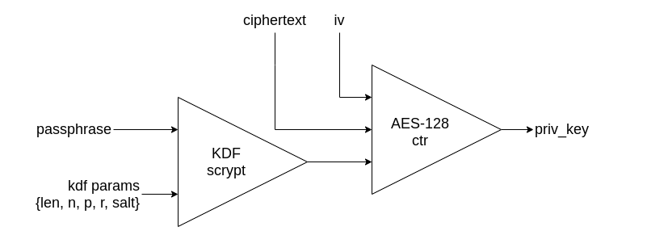

<H1>RECUPERACIÓN DE LLAVE PRIVADA DEL ETHEREUM KEYSTORE</H1>

script para recuperar clave privada desde archivos contenidos en keystore conociendo el passphrase asociado.

Según lo investigado hasta ahora el proceso seguido para el almacenamiento de el par de llaves tanto en Ethereum como en Quorum, sigue el siguiente esquema de cifrado:

Tanto Ethereum como Quorum almacenan las llaves en el directorio <b>Keystore</b> y todos los parámetros requeridos están contenidos en los archivos json, que son almacenados dentro de éste directorio. El keystore contiene los datos necesarios para la reconstrucción de la llave privada asociada a la dirección pública contenida en los archivos json.

Cada archivo json en el directorio posee la información asociada a cada dirección pública. El archivo contiene los parámetros para generar una clave derivada kdf que a su vez es utilizada para generar la llave privada a la salida del módulo de cifrado aes-128-ctr. Para poder regenerar la llave es necesario contar con el <b>passphrase</b> que el cliente (o la aplicación internamente) ha utilizado para construir la dirección.

Cabe destacar que el ciphertext requerido como parámetro de entrada al módulo AES corresponde a la clave privada Ethereum cifrada.

<li>Parámetros requeridos para el módulo KDF: {klen,r,n,p,salt} y el passphrase.
<li>Parámetros requeridos para el módulo AES-128-CTR: {iv, ciphertext, kdf_key}.

<H2>Verificación de la MAC</H2>
una vez determinada la clave derivada (kdf) se procede a verificar la MAC teniendo en cuenta que se debe realizar una concatenación de los 16 bytes menos significativos del kdf en hexadecimal con el ciphertext en hexadecimal (concatenacion_hex = kdf_hex[32:64] + ciphertext_hex). Al resultado de la concatenación se le calcula la huella utilizando el estandar keccak_256 (keccak_256(concatenacion_bytes)).

<H2>Decifrado de la Clave Privada</H2>
se pasan los siguientes parámetros al módulo AES-128-CTR:
  <li>vector de inicialización en entero (iv_int = int(iv,16))
  <li>16 bytes más significativos de la kdf en bytes (kdf_key_bytes)
  <li>ciphertext en bytes (ciphertext_bytes)
    
 el resultado obtenido es convertido a hexadecimal (decrypted_priv_key_hex).
